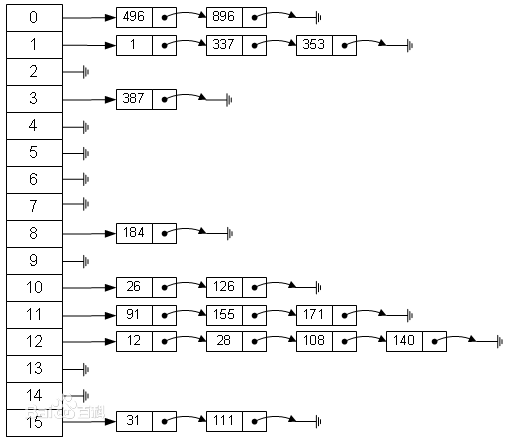

# HashMap实现原理
下图为Hashtable的实现方式

可以看到，hashtable的实现是数组+链表的结构，图为长度为16的数组存储的是链表的头节点,决定链表内的数据存储内容的实现一般是通过hash(key)%length,也就是元素的大小除以数组的长度，比如12%16=12  28%16=12  108%16=12  140%16=12 那么12、28、108、140均存储在12的位置。
 
 
对HashMap而言，HashMap几乎可以等价于Hashtable，除了HashMap是非synchronized(同步)的，并可以接受null(HashMap可以接受为null的键值(key)和值(value)，而Hashtable则不行)

**1)put**
<pre><code>
源码:
    public V put(K key, V value) {
        if (key == null)
            return putForNullKey(value);
        int hash = hash(key.hashCode());
        int i = indexFor(hash, table.length);//return index for hash code hash
        for (Entry<K,V> e = table[i]; e != null; e = e.next) {
            Object k;
            if (e.hash == hash && ((k = e.key) == key || key.equals(k))) {
                V oldValue = e.value;
                e.value = value;
                e.recordAccess(this);
                return oldValue;
            }
        }

        modCount++;
        addEntry(hash, key, value, i);
        return null;
    }
</code></pre>

<pre><code>
参考下LinkedHashMap 

/** 
         * This method is invoked by the superclass whenever the value 
         * of a pre-existing entry is read by Map.get or modified by Map.set. 
         * If the enclosing Map is access-ordered, it moves the entry 
         * to the end of the list; otherwise, it does nothing. 
         */ 
        void recordAccess(HashMap<K,V> m) { 
            LinkedHashMap<K,V> lm = (LinkedHashMap<K,V>)m; 
            if (lm.accessOrder) { 
                lm.modCount++; 
                remove(); 
                addBefore(lm.header); 
            } 
        } 

        void recordRemoval(HashMap<K,V> m) { 
            remove(); 
        } 
</code></pre>
